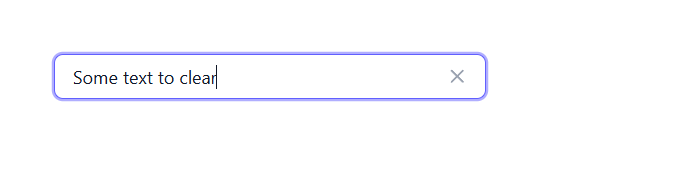
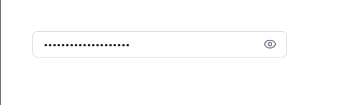
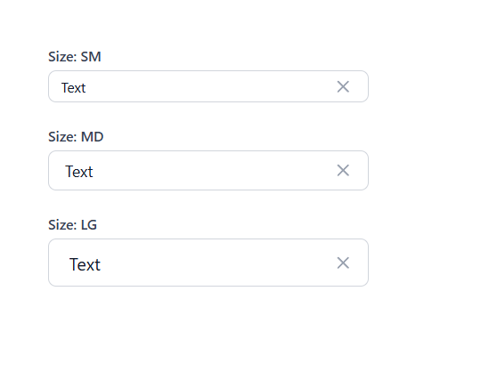
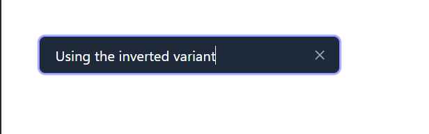
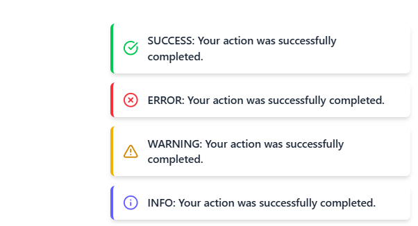
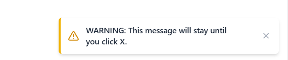
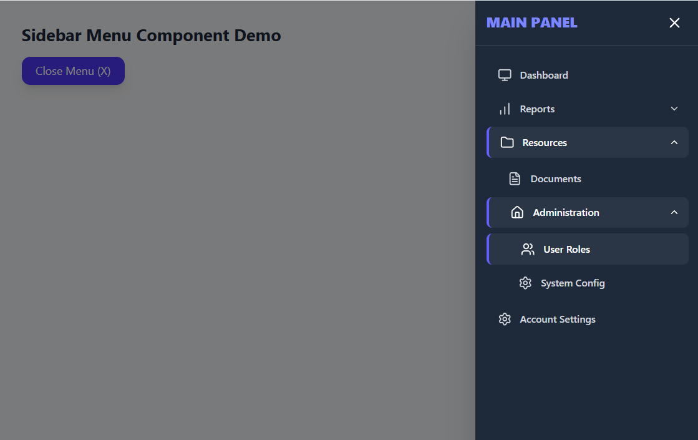
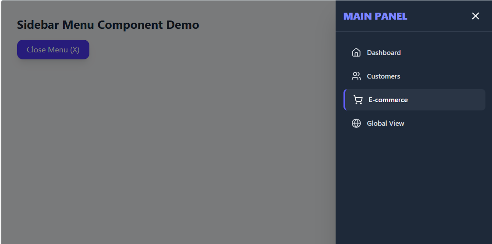

React Component Library Assessment
Project Overview
This repository serves as a test assessment demonstrating the implementation of a small, reusable UI component library. The system is built with React and TypeScript and documented using Storybook for comprehensive visual testing and component documentation.

The implementation focuses on code quality, modularity, proper use of modern React hooks, and an engaging user experience, including animation where necessary.

Technology Stack
Framework: React (Vite)

Language: TypeScript

Styling: Tailwind CSS

Documentation: Storybook

Animation: Framer Motion

Setup and Launch
Follow these steps to set up the project and run the Storybook environment locally:

# 1. Clone the repository
git clone https://github.com/svbarytskiy/devs-today-test

# 2. Navigate to the project directory
cd devs-today-test

# 3. Install dependencies
npm install

# 4. Launch Storybook
npm run sb

 Component Implementation Overview

 1. Input Component 
A smart, versatile input field supporting standard HTML input types, enhanced with the following key features:

Password Visibility Toggle: When type="password" is used, an eye icon appears to toggle the masked/unmasked view.

Clearable Input: The clearable prop displays an "X" button for quick field reset.

Sizing: The size prop controls vertical padding and font size, supporting sm, md (default), and lg.

Inverted Look: The inverted prop reverses the component's color scheme.

2. Toast Notification Component 
A non-intrusive feedback mechanism for displaying status messages to the user. The Toast system supports four visual variants: success, error, warning, and info. It appears in a fixed position, adhering to the bottom-right (and top-right) corner. The component uses Framer Motion for a smooth slide-in/slide-out transition, automatically hides after a specified duration, 
and includes an optional button for manual closing.

3. Sidebar Menu Component 
A multi-level navigation menu designed for use in application layouts. The Sidebar slides in smoothly from the right side of the screen. It renders nested submenus using an expandable/collapsible (accordion) pattern. State management (open/closed) is handled internally, and the menu closes upon clicking the background backdrop or the dedicated close button.

